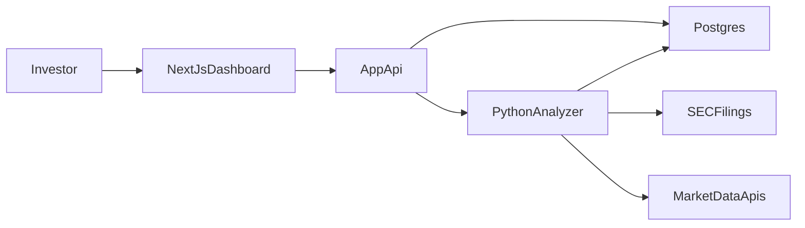

# Stock Analyzer MVP Plan

## Current State

The repo is effectively empty today and only contains [README.md](README.md), so this should be treated as a greenfield build.

## Recommended Architecture

Use a split architecture optimized for fast product iteration:

- `apps/web`: Next.js app for the dashboard, screeners, ticker search, and report pages.
- `services/analyzer`: Python service for financial document parsing, feature extraction, scoring, and forecasting.
- `packages/shared`: shared TypeScript types for API responses and scoring output.
- `supabase` or `db`: Postgres schema for company fundamentals, filing-derived metrics, peer groups, model outputs, and cached reports.

## Product Scope For V1

Ship one strong research workflow first:

1. Search by ticker or company and open a full analysis page.
2. Show core metrics from recent earnings and filings: revenue, net income, EPS, margins, growth, cash flow, debt, valuation multiples.
3. Rank the stock against peers in its industry.
4. Generate a model score for long-term attractiveness at the current price.
5. Produce a simple forecast band and analyst-style narrative summary with clear confidence and caveats.

## Data Strategy

Because you want a low-cost MVP, prefer this ingestion mix:

- SEC EDGAR filings and earnings transcripts when available for primary financial-document analysis.
- One low-cost fundamentals/price API for normalized market data, prices, sector/industry, and basic estimates if available.
- A peer-mapping layer based on sector, industry, market cap band, and optional manual overrides.

Store both raw inputs and normalized features so model logic can be improved without re-fetching everything.

## Modeling Strategy

Avoid starting with a single opaque model. Build a staged scoring system first, then add forecasting:

- `Document extraction layer`: parse 10-K, 10-Q, 8-K, and earnings materials into structured metrics and textual signals.
- `Factor scoring layer`: growth, profitability, balance-sheet health, valuation, estimate revisions, and earnings quality.
- `Peer-relative ranking layer`: percentile ranks within industry and market-wide universe.
- `Forecast layer`: start with a baseline probabilistic return model using historical factor relationships and scenario assumptions instead of a fully agentic LLM-driven predictor.
- `Narrative layer`: use an LLM only to summarize structured evidence into a readable report, not to decide scores by itself.

This keeps the system explainable and cheaper to operate.

## Core Screens And APIs

Initial files and modules to create:

- [apps/web/app/page.tsx](apps/web/app/page.tsx): landing page with ticker search and top-ranked ideas.
- [apps/web/app/stocks/[ticker]/page.tsx](apps/web/app/stocks/[ticker]/page.tsx): full dashboard for a single stock.
- [apps/web/app/screener/page.tsx](apps/web/app/screener/page.tsx): industry and market ranking view.
- [apps/web/components/StockDashboard.tsx](apps/web/components/StockDashboard.tsx): KPIs, charts, scorecards, and competitor table.
- [services/analyzer/app/main.py](services/analyzer/app/main.py): analysis API entrypoint.
- [services/analyzer/app/pipeline.py](services/analyzer/app/pipeline.py): filing ingestion, feature extraction, scoring, and forecast orchestration.
- [services/analyzer/app/scoring.py](services/analyzer/app/scoring.py): explainable composite score logic.
- [services/analyzer/app/forecast.py](services/analyzer/app/forecast.py): expected-return and scenario model.
- [packages/shared/src/types.ts](packages/shared/src/types.ts): shared dashboard and ranking schemas.

## Delivery Phases

### Phase 1

Set up monorepo, database schema, ticker universe, ingestion jobs, and a single-stock dashboard with static/mock data.

### Phase 2

Implement filing ingestion, normalized metrics, peer identification, and explainable scorecards.

### Phase 3

Add market-wide and industry-wide ranking, watchlist-ready APIs, and the first forecast model.

### Phase 4

Improve the narrative report with analyst-style explanations, confidence intervals, and long-term portfolio suitability guidance.

## Technical Risks To Design Around

- SEC filings are messy and inconsistent, so extraction must be cacheable and testable.
- Free data sources often have missing analyst-consensus fields, so the first release should not depend on them.
- Forecasting long-term returns is noisy; show ranges, assumptions, and confidence instead of single-point claims.
- Competitor mapping is never perfect; keep manual override support in the schema.

## Suggested Default Stack

Unless you want a different stack, the most practical default is:

- Next.js + TypeScript for UI and app APIs
- Python + FastAPI for analysis jobs and model code
- Postgres for normalized financial data and cached outputs
- Background jobs for ingestion and periodic model refreshes

This gives you a fast UI layer and a Python-native modeling workflow without overcomplicating the MVP.