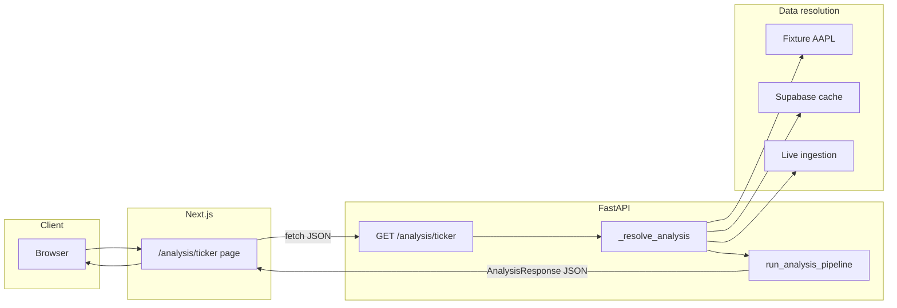
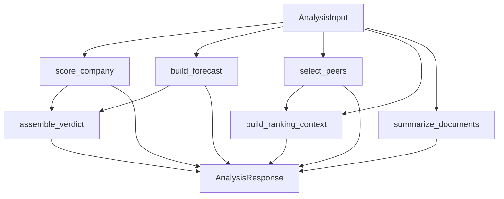
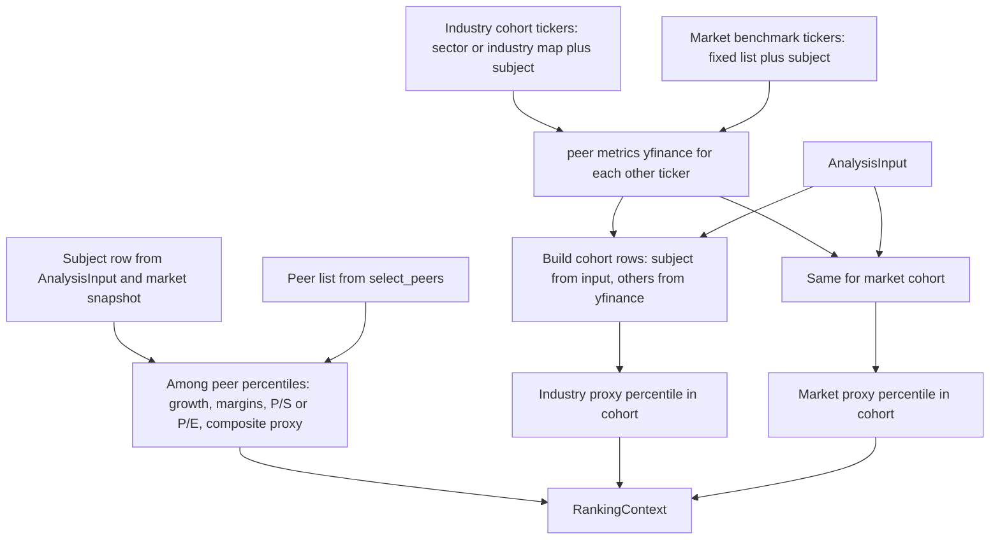

# Stock Analyzer: What We Built, How It Works, and Workflows

This document explains the changes made during the implementation pass, how the app behaves end to end, and how data flows from a ticker to the dashboard. It is meant to stay in sync with the code under `backend/` and `frontend/`.

---

## 1. What was already there

The repository was not empty: it already had a working **Next.js** frontend and **FastAPI** backend:

- **Ingestion**: Resolve a US ticker, pull SEC metadata and filings, pull market data via `yfinance`, normalize into a shared contract called `AnalysisInput` (company snapshot, financial periods, filings, market snapshot).
- **Analysis modules**: Deterministic **scoring** (pillar weights), **forecast** scenarios (bear/base/bull), **peer** selection from sector/industry maps with live yfinance peer rows, **verdict** (long-term rating and confidence), **document summary** (qualitative, filing-aware).
- **API**: e.g. `GET /analysis/{ticker}` returns a full `AnalysisResponse` for the UI; `POST /analyze/{ticker}` runs live ingestion; fixture path (e.g. AAPL) works without Supabase.
- **UI**: Ticker search and a deep **analysis** page with score, verdict, market card, forecast table, peer table, financials, filings.

---

## 2. What was added in the implementation pass

The following was added to match the v1 plan’s **industry and market “ranking context”** on the same deep-research page, without building a separate screener app:

| Area | Change |
|------|--------|
| **Data model** | `AmongPeersRanks` and `RankingContext` on `AnalysisResponse` (and `PeersResponse` for the dedicated peers route). |
| **Logic** | New module `backend/app/analysis/ranking.py`: builds **percentiles within the live peer set**, a **larger industry cohort** (from the same industry/sector peer pools the peer picker uses), and a **fixed market benchmark** list of liquid tickers. Uses the same yfinance-based peer metrics as the peer table, with the **analyzed company’s** row taken from the ingested `AnalysisInput` so filing-normalized values drive the subject when present. |
| **Pipeline** | `run_analysis_pipeline` calls `build_ranking_context(analysis_input, peers)` after `select_peers`. |
| **API** | `GET /peers/{ticker}` returns peers plus `ranking_context` (same resolution rules as `GET /analysis/{ticker}`, including `?refresh=true`). |
| **Frontend** | `RankingContextPanel` on the analysis page, and TypeScript types for `ranking_context`. |
| **Tests** | The fixture pipeline test asserts that `ranking_context` is present. |

**Important:** Rank numbers are a **transparent proxy** (min-max normalized growth, margins, and a value lean from P/E) within each cohort. They are **not** the same as the long-term **rating** from scoring and scenarios, and they are not a return forecast. The UI and API include a `methodology_note` string that states this.

---

## 3. How it works (conceptual)

1. The user (or another client) requests analysis for a ticker, e.g. `GET /analysis/MSFT` or the Next.js page `GET /analysis/MSFT` which calls the same JSON API.
2. The backend **resolves** the payload: for supported fixtures (e.g. AAPL) it loads a bundled `AnalysisInput`. Otherwise, if **Supabase** is configured, it can load a cached `AnalysisInput` or run **live ingestion** and persist, then run the pipeline. If neither fixture nor storage nor live path applies, the API returns 404 with a clear message.
3. **Run analysis** takes that `AnalysisInput` and runs, in order: scoring, forecast, peer selection, **ranking context**, verdict, optional document summary.
4. The **Next.js** server component fetches the JSON and renders cards and tables, including the new **ranking context** panel, then peer comparison, then fundamentals and filings.

---

## 4. End-to-end workflow (HTTP and UI)

---

## 5. Analysis pipeline (inside the backend)

This is the order of work after an `AnalysisInput` exists, whether from a fixture, cache, or fresh ingestion.

**Dependencies worth noting**

- `ranking_context` **depends on** `peers` (same call to `select_peers`) and on `AnalysisInput` (subject financials and market line).
- The **verdict** uses score and forecast, not the ranking proxy, so the long-term **rating** stays in the scoring and verdict modules as before.

---

## 6. Ranking context workflow (the new piece)

This diagram focuses on `build_ranking_context` and how the three “views” (among peers, industry, market) are produced.

**Cohorts in plain language**

- **Among peers:** The app compares your line to the **up to N peers** returned for the table. Percentiles are **0 to 100** (higher means stronger on that raw or blended measure within that set), with a small composite from normalized growth, margins, and a value-lean term.
- **Industry:** Tickers are drawn from the same **curated industry or sector pool** used to seed peer discovery, capped for performance. The subject is always included; missing yfinance names are dropped.
- **Market:** A **static list** of large liquid names acts as a coarse “whole market” benchmark; again the subject is included and the same proxy logic applies.

---

## 7. File map (pointers)

| Concern | Location |
|--------|----------|
| API routes | `backend/app/api/routes.py` |
| Pipeline | `backend/app/analysis/pipeline.py` |
| Peers + industry pools | `backend/app/analysis/peers.py` |
| Ranking / percentiles | `backend/app/analysis/ranking.py` |
| Response models | `backend/app/models/analysis_output.py` |
| Analysis page UI | `frontend/src/app/analysis/[ticker]/page.tsx` |
| Ranking panel | `frontend/src/components/RankingContextPanel.tsx` |
| Client types | `frontend/src/lib/types.ts` |
| `GET /analysis` fetch | `frontend/src/lib/api.ts` |

---

## 8. How to run it locally (short)

- Backend: from repo root, with dependencies installed, `uvicorn backend.app.main:app --reload`
- Frontend: `cd frontend && npm run dev`, with `NEXT_PUBLIC_API_BASE_URL` pointing at the API (default is often `http://127.0.0.1:8000`).

For live tickers, configure Supabase and env per `backend/README.md` and `backend/.env.example`.

This file is a living description. When you change the pipeline, cohort lists, or API shapes, update the diagrams and tables here so the doc stays useful for onboarding and design reviews.
